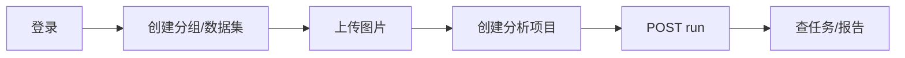

# 测试计划 v1

> 版本：v1.0 | 日期：2026-06-03 | 状态：**用例设计阶段，未执行**

## 1. 目标

在 Monorepo + Docker Compose 重构后，建立可重复的验证基线，确保：

- 四服务（MySQL / API / Python / 前端）可协同启动
- 核心用户路径可用：登录 → 数据集 → 分析项目 → 报告
- 为后续 CI 门禁提供用例来源

## 2. 范围

| 在范围内 | 不在本期 |
|----------|----------|
| API 契约与主路径（P0/P1） | 算法精度/论文级指标回归 |
| Docker 冒烟 | 全量 E2E（Playwright） |
| 前端关键页面手工检查（P2） | 80% 单元测试覆盖率 |
| JWT 鉴权、错误码 | 压力/性能测试 |

## 3. 测试环境

### 3.1 标准环境（推荐）

```bash
cp .env.docker.example .env
docker compose up --build
```

| 组件 | 地址 |
|------|------|
| API | `http://localhost:8080` |
| Python | 容器内 `http://python:5000`（宿主机一般不直连） |
| 前端 | `http://localhost:3000`（或 `.env` 中 `FRONTEND_PORT`） |
| MySQL | `localhost:3306`，库 `color_analysis` |

### 3.2 前置数据

- 默认用户：`admin` / `admin123`（`DataInitializer` 创建）
- 图片样例：待放入 `tests/fixtures/images/`（见 fixtures README）
- 分析 run 所需 `model_image.jpg`、`butterfly.json`、`edge.json` 见 `algorithm-service/`

## 4. 优先级定义

| 级别 | 名称 | 说明 | 用例文件 |
|------|------|------|----------|
| **P0** | 冒烟 | 服务存活 + 登录 + Swagger | `cases/P0-smoke.md` |
| **P1** | API 功能 | 各模块 REST 主路径 | `cases/P1-api-*.md` |
| **P2** | 前端手工 | UI 可操作、与 API 联调 | `cases/P2-frontend-manual.md` |
| **P3** | 自动化 | 脚本/CI（后续） | `scripts/` |

**通过标准（本期）：** P0 全部通过，P1 核心路径 ≥ 90% 通过，P2 主流程可走通。

## 5. 核心用户旅程（E2E 逻辑，本期可手工拆步）



对应用例链：`AUTH-*` → `GRP-*` / `DS-*` → `PRJ-*` → `RPT-*`。

## 6. 缺陷记录

执行时在用例表更新「状态」列；失败用例另记 Issue，注明：

- 用例 ID、请求/响应摘要、日志位置（`docker logs color-api` 等）

## 7. 后续自动化路线图

1. `scripts/smoke.sh` — curl 执行 P0
2. Newman 导入现有 Postman 集合，对齐 P1 用例 ID
3. Spring Boot + Testcontainers 替代空 `contextLoads`
4. GitHub Actions：`compose up` + `scripts/smoke.sh`

## 8. 评审检查项

- [ ] P0 是否覆盖全部服务健康检查？
- [ ] P1 是否覆盖「创建数据集 → run 项目 → 读报告」？
- [ ] 算法接口是否仅需抽样（canny）而非全算法压测？
- [ ] fixtures 最小集是否明确（1 张 PNG + 模板图）？
